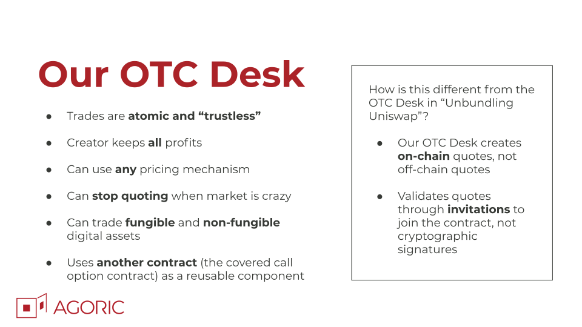
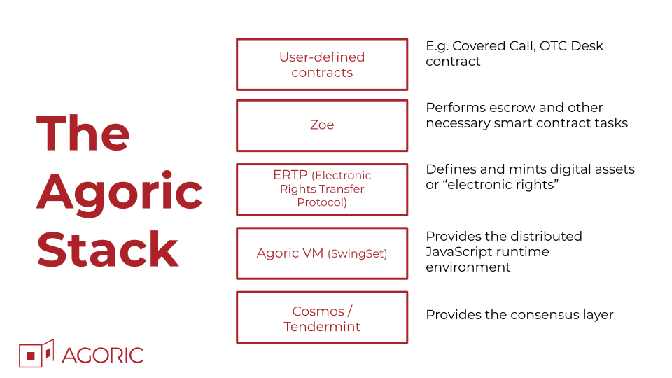

# OTC Desk Contract


This repo contains the OTC Desk contract from the ["Building a
Composable DeFi Contract" Cosmos Code With Us
episode](https://cosmos.network/series/code-with-us/building-a-composable-defi-contract).

[Watch the replay of the
workshop](https://www.youtube.com/watch?v=faxrecQgEio):
[](https://www.youtube.com/watch?v=faxrecQgEio)


## Functionality

The OTC Desk contract is based on an idea by Haseeb Qureshi in
["Unbundling Uniswap: The Future of On-Chain Market Making"](https://medium.com/dragonfly-research/unbundling-uniswap-the-future-of-on-chain-market-making-1c7d6948d570)



In this OTC Desk Contract:
* Trades are atomic and “trustless”
* Creator keeps all profits
* Can use any pricing mechanism
* Can stop quoting when market is crazy
* Can trade fungible and non-fungible digital assets
* Uses another contract (the [covered call option contract](https://github.com/Agoric/agoric-sdk/blob/master/packages/zoe/src/contracts/coveredCall.js)) as a reusable component

This contract runs on the Agoric Stack:




## Run the Tests

Unlike the basic Encouragement Dapp, this dapp only includes the
contract portion. It does not include the browser UI or API server.
However, it does include tests for the contract and the deploy script
to install the contract code on Zoe.

To run the tests:

```shell
yarn test
```

## Install the Code on Zoe

To install the OTC Desk code on your local version of Zoe, run:

```shell
agoric install
agoric start --reset
```
and then in another terminal tab:

```shell
agoric deploy contract/deploy.js
```

You will see something like the following if successful:

```
Open CapTP connection to ws://127.0.0.1:8000/private/captp...o
agoric: deploy: running contract/deploy.js
- SUCCESS! contract code installed on Zoe
-- Contract Name: OTC Desk
-- Installation Board Id: 1456154132
```

